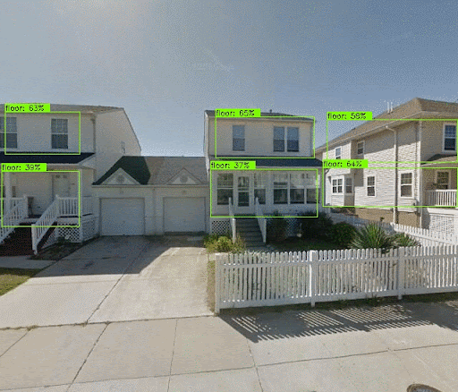
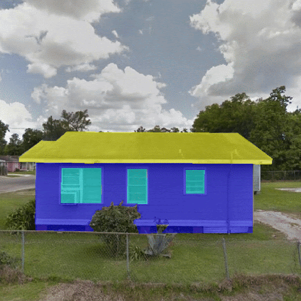
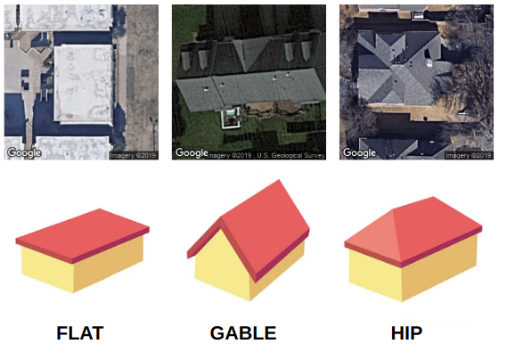

## About 

**BRAILS** (Building Recognition using AI at Large-Scale) provides a set of Python modules that utilize deep learning (DL), and computer vision (CV) techniques to extract information from satellite and street level images. The BRAILS framework also provides turn-key applications allowing users to put individual modules together to determine multiple attributes in a single pass or train general-purpose image classification, object detection, or semantic segmentation models.


Detection             |  Segmentation |  Classification 
:-------------------------:|:-------------------------:|:-------------------------:
  |   | 

## Modules

### Classifiers

Classifiers sort buildings into categories:

| Module Name | Output | Regions whose data the model has trained on | Dataset Source |
|---|---|---|---|
| Roof Shape Classifier | Roof types:<br>Flat, Gabled, Hipped, | Texas, Louisiana, Mississippi, Alabama, Georgia, Florida, South Carolina, North Carolina, Virginia, New Jersey | Google Static Satellite Maps |
| Occupancy Classifier | Single family/multi family/commercial use | Entire US | Google Street View |
| Year Built Classifier | One of 6 time periods | New Jersey, Louisiana | Google Street View |
| Roof Cover Classifier  | If a building has soft-story or not | Entire US | Google Street View |

### Detectors

Detectors locate objects in images:

| Module Name | Output | Regions whose data the model has trained on | Dataset Source |
|---|---|---|---|
| Garage Detector | Bounding Box of Garage | Unkown (not disclosed by the developer) | Google Street View/Zooniverse |
| Chimney Detector | Bounding Box of Chimney | Unkown (not disclosed by the developer) | Google Street View/Zooniverse |
| Number of Floors Detector | Bounding Box of floors | New Jersey, Louisiana | Google Street View |


### Segmentors

| Module Name | Output | Regions whose data the model has trained on | Dataset Source |
|---|---|---|---|
| Facade Parser | pixels of roof, facade and window | Unknown | Unknown

Facade Parser segements facade of a buidling into roof, facade and window, enables automated predictions of building eave height, roof peak height, roof pitch angle and ratio of window area to facade area from image input.


### Learn More

Instrcutions for each module can be found in the [documentation](https://nheri-simcenter.github.io/BRAILS-Documentation/common/user_manual/modules/modules.html).

## Workflow

Given the a quiried location, we get building footprints from [Microsoft. US Building Footprints](https://github.com/microsoft/USBuildingFootprints), and 
and all models (apart from segementation models) are trained on images acquired from Google (Street View and Static Maps) or Zooniverse, below are a few samples from the trainig data.

## Quick Start

### Try it:
You can [try it on Google Colab](https://colab.research.google.com/drive/1zspDwK-rGA1gYcHZDnrQr_3Z27JL-ooS?usp=sharing) without local installation.

### Installation:

Brails is compatible with `python 3.7` and above.

The easiest way to install the latest version of BRAILS is using ``pip``:
```
pip install git+https://github.com/NHERI-SimCenter/BRAILS
```

### Example: InventoryGenerator Workflow

This example demonstrates how to use the ``InventoryGenerator`` method embedded in BRAILS to generate regional-level inventories. 

The primary input to ``InventoryGenerator`` is location. ``InventoryGenerator`` accepts four different location input: 
1. region name 
2. list of region names
3. bounding box of a region 
4. A GeoJSON file containing building footprints.

Please note that you will need a **Google API Key** to run ``InventoryGenerator``, [here are instructions on how to create it](https://developers.google.com/maps/documentation/embed/get-api-key).

```python
#import InventoryGenerator:
from brails.InventoryGenerator import InventoryGenerator

# Initialize InventoryGenerator:
invGenerator = InventoryGenerator(location='Berkeley, CA',
                                  nbldgs=100, randomSelection=True,
                                  GoogleAPIKey="")

# Run InventoryGenerator to generate an inventory for the entered location:
# To run InventoryGenerator for all enabled attributes set attributes='all':
invGenerator.generate(attributes=['numstories','roofshape','buildingheight'])

# View generated inventory:
invGenerator.inventory

```
### User Guide

Full documentation is available at https://nheri-simcenter.github.io/BRAILS-Documentation. You can also compile the latest doc following `./doc/README.md`.


## Acknowledgements

This work is based on material supported by the National Science Foundation under grants CMMI 1612843 and CMMI 2131111.

## Contact
NHERI-SimCenter nheri-simcenter@berkeley.edu

## Cite

```
@software{cetiner_2022_7132010,
  author       = {Barbaros Cetiner and
                  Charles Wang and
                  Frank McKenna and
                  Sascha Hornauer and
                  Yunhui Guo},
  title        = {BRAILS Release v3.0.0},
  month        = sep,
  year         = 2022,
  note         = {{This work is based on material supported by the 
                   National Science Foundation under grants CMMI
                   1612843 and CMMI 2131111}},
  publisher    = {Zenodo},
  version      = {v3.0.0},
  doi          = {10.5281/zenodo.7132010},
  url          = {https://doi.org/10.5281/zenodo.7132010}
}
```